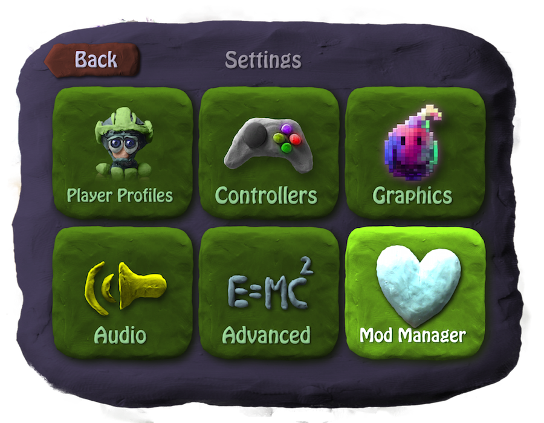
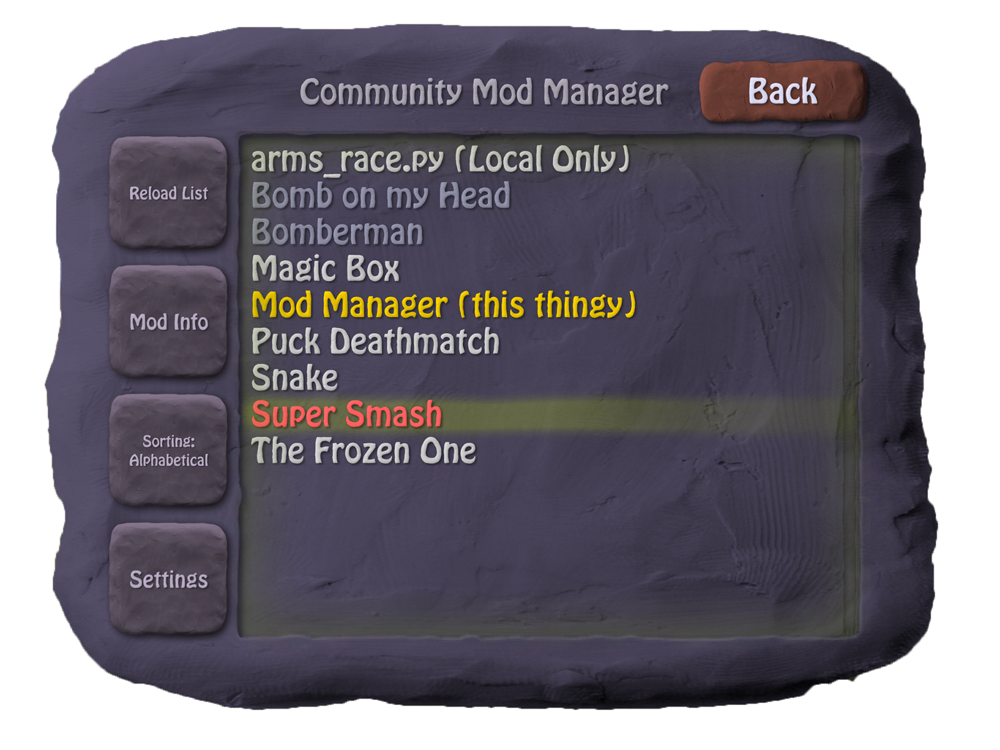

<h1>BombSquad Community Mod Manager</h1>

<h2>What is it?</h2>

This is a mod for the game <a href="http://www.froemling.net/apps/bombsquad">BombSquad</a> by <a href="http://www.froemling.net/about">Eric Froemling</a> that aims to improve the management of community created content for BombSquad.

It's build using the modding api so it can be used on all platforms and should be compatible with all recent versions of BombSquad.

A list of all mods can be viewed [here](http://mrmaxmeier.github.io/BombSquad-Community-Mod-Manager), you can also filter by category ([all minigames](http://mrmaxmeier.github.io/BombSquad-Community-Mod-Manager/#/category/minigames)) or view specific mods ([mod manager](http://mrmaxmeier.github.io/BombSquad-Community-Mod-Manager/#/mod/modManager)).

<h2>Installation</h2>

Put <a href="https://raw.githubusercontent.com/Mrmaxmeier/BombSquad-ModManager-and-Mods/master/utils/installer.py">installer.py</a> in your mods folder. This file will download and install the Mod-Manager and its dependencies.
You can find your mods folder in Settings > Advanced > Show Mods Folder.

<h6>Note:</h6>
On Android M or higher you'll need to give BombSquad access to the storage. You can do that by clicking on `Settings > Advanced > Show Mods Folder` or enabling it manually in the system settings.

| Platform  | Path       |
| --------- | ---------- |
| OS X      | ~/Library/Containers/net.froemling.bombsquad/Data/Library/Application Support/BombSquad/mods |
| Android   | *<*sdcard*>*/BombSquad/mods  |
| Windows   | %appdata%/BombSquad/mods |
| Linux     | ~/.bombsquad/mods            |

<h4>One-Liners</h4>
<table>
  <tr>
    <td>OSX</td>
    <td>
      <pre>cd ~/Library/Containers/net.froemling.bombsquad/Data/Library/Application\ Support/BombSquad/mods && curl -O https://raw.githubusercontent.com/Mrmaxmeier/BombSquad-Community-Mod-Manager/master/utils/installer.py</pre>
    </td>
  </tr>
  <tr>
    <td>Linux (wget)</td>
    <td>
      <pre>wget -P ~/.bombsquad/mods https://raw.githubusercontent.com/Mrmaxmeier/BombSquad-Community-Mod-Manager/master/utils/installer.py</pre>
    </td>
  </tr>
  <tr>
    <td>Linux (curl)</td>
    <td>
      <pre>cd ~/.bombsquad/mods && curl -O https://raw.githubusercontent.com/Mrmaxmeier/BombSquad-Community-Mod-Manager/master/utils/installer.py</pre>  
    </td>
  </tr>
  <tr>
    <td>Windows (PowerShell)</td>
    <td>
      <pre>wget https://raw.githubusercontent.com/Mrmaxmeier/BombSquad-ModManager-and-Mods/master/utils/installer.py -OutFile $env:APPDATA/BombSquad/mods/installer.py</pre>
    </td>
</table>

<h2>Usage</h2>

After restarting BombSquad there should be a new button in the settings window.

Upon clicking this button a new window pops up.

You can download, install or delete mods here.


<h4>Tabs</h4>
The mods are grouped in three categories:

<table>
  <tr>
    <td>Minigames</td>
    <td>Installing these will add games to the game select screen.</td>
  </tr>
  <tr>
    <td>Utilities</td>
    <td>These are mods that add UI elements or other non game related things </td>
  </tr>
  <tr>
    <td>Libraries</td>
    <td>These are mods that can be used as libraries by other mods.</td>
  </tr>
</table>

You can also view all mods using the 'all' tab.


<h4>Settings</h4>
There is a settings button in the mod manager window.

| Setting | More infos |
| ---------- | ---------- |
| Branch     |  A List of all available branches can be found [here](https://api.github.com/repos/Mrmaxmeier/BombSquad-Community-Mod-Manager/branches)   |
| Auto check for updates | This will check for updates while BombSquad is starting |
| Auto-update old mods | This will update mods with versions that are known to be old. <br \>Mods you are developing won't get updated by this. |


<h2>Contributing</h2>

Want to contribute? Great!

1. Fork it
2. Create a new file in the mods folder
3. Add a json file with additional infos (optional)
5. Open a Pull Request
6. Profit

<h2>License</h2>

```
This is free and unencumbered software released into the public domain.

Anyone is free to copy, modify, publish, use, compile, sell, or
distribute this software, either in source code form or as a compiled
binary, for any purpose, commercial or non-commercial, and by any
means.

In jurisdictions that recognize copyright laws, the author or authors
of this software dedicate any and all copyright interest in the
software to the public domain. We make this dedication for the benefit
of the public at large and to the detriment of our heirs and
successors. We intend this dedication to be an overt act of
relinquishment in perpetuity of all present and future rights to this
software under copyright law.

THE SOFTWARE IS PROVIDED "AS IS", WITHOUT WARRANTY OF ANY KIND,
EXPRESS OR IMPLIED, INCLUDING BUT NOT LIMITED TO THE WARRANTIES OF
MERCHANTABILITY, FITNESS FOR A PARTICULAR PURPOSE AND NONINFRINGEMENT.
IN NO EVENT SHALL THE AUTHORS BE LIABLE FOR ANY CLAIM, DAMAGES OR
OTHER LIABILITY, WHETHER IN AN ACTION OF CONTRACT, TORT OR OTHERWISE,
ARISING FROM, OUT OF OR IN CONNECTION WITH THE SOFTWARE OR THE USE OR
OTHER DEALINGS IN THE SOFTWARE.

For more information, please refer to <http://unlicense.org>
```
